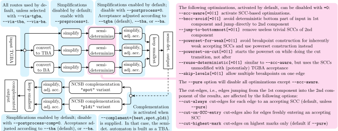

# Seminator
Seminator is a free tool for semi-determinization of omega-automata.

## Installation
Seminator depends on the [Spot](https://spot.lrde.epita.fr/index.html) library. You need a version 2.8.3 or higher installed in your system before compiling Seminator.  Also, unless Python bindings are disabled (with `./configure --disable-python`), you will need Python 3 development files installed on your system.

After Spot is installed you can run `./configure && make` to compile Seminator.

You may use `./configure --prefix=PREFIXDIR && make && sudo make install` to install Seminator in the same place as Spot.  If you need to install Seminator in a different location, use `./configure --prefix=OTHERDIR --with-spot=PREFIXDIR`, replacing `PREFIXDIR` by the directory that was passed to Spot's `--prefix` configuration option.

## Basic usage
The following command translates a possibly nondeterministic transition-based generalized Büchi automaton (TGBA) placed in file `aut.hoa` into a semi-detetrministic Büchi automaton (SDBA) and prints the result int the [HOA format](https://adl.github.io/hoaf/) to the standard output.
```
./seminator aut.hoa
```

For more information run:
```
./seminator --help
```

The following picture gives a summary of the different options and how they affect the tool.


## Python bindings

For example of using the Python bindings, see the notebooks in the `notebooks/` directory.  [](https://nbviewer.jupyter.org/github/mklokocka/seminator/tree/next/notebooks/)

Unless you have run `make install` to install the `seminator` binary and all the Python bindings, is using the bindings require a bit of setup to make sure that Python finds the correct files.  The easiest way to use the non-installed bindings is use the `tests/pyrun` script: use `tests/pyrun python3` or `tests/pyrun jupyter notebook` for interactive uses, or `tests/pyrun mycript.py` for an actual script.

## Experimental evaluation

Version 1.1 of Seminator was presented in the paper _František Blahoudek, Alexandre Duret-Lutz, Mikuláš Klokočka, Mojmir Kretinsky and Jan Strejcek. **Seminator: A Tool for Semi-Determinization of Omega-Automata.** In Proceedings of [LPAR-21](http://easychair.org/smart-program/LPAR-21/LPAR-index.html), 2017.  Version 1.2 add some minor optimizations, and an updated experimental evaluation.  If you want to see those results, check out the source for [version 1.2](https://github.com/adl/seminator/tree/v1.2.0).

Experimental evaluation for version 2.0 is kept separate from this repository, and can be found at *FIXME*.

### Requirements

If you would like to run the notebooks or the test-suite, you need to
have the folowing tools installed in `PATH` on your system.

* [SPOT](https://spot.lrde.epita.fr/) v. 2.8.3+ with Python bindings
* [Jupyter](http://jupyter.org/) notebook v 5.0+
